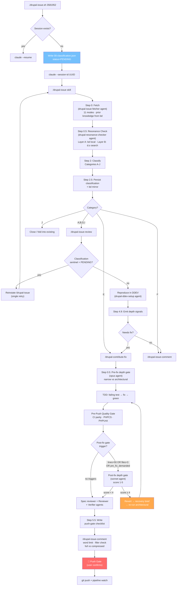
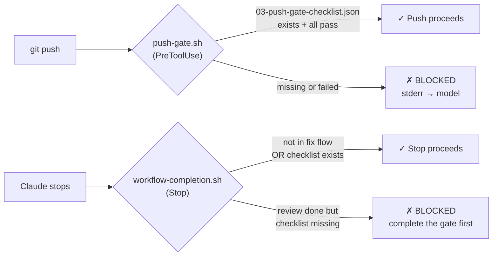
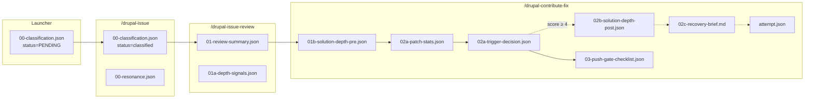

# Drupal Contrib Workbench

An automated workflow for fixing, reviewing, and contributing to Drupal.org issues — powered by Claude Code with structured skills, subagents, and mechanical enforcement hooks.

## How it works

```
./drupal-issue.sh <issue-id-or-url>
```

That single command fetches the issue, classifies it, reviews/reproduces it, writes a fix with tests, runs the full CI pipeline locally, gets it reviewed by 3 independent agents, drafts a d.o comment, and stops at a push gate for your confirmation. The entire flow is hands-free after invocation.



## Classification categories

| Cat | When | Action |
|-----|------|--------|
| **A** | Bug report, unconfirmed | Review → reproduce → fix |
| **B** | MR exists, needs review | Review → verify MR → comment |
| **C** | Fix on one branch, needs porting | Adapt → package → push gate |
| **D** | Retarget to different branch | Update MR target → push gate |
| **E** | Reviewer feedback to address | Fix → push gate |
| **F** | Needs a knowledgeable reply | Comment only |
| **G** | Bug with no MR, write from scratch | Review → reproduce → fix |
| **H** | Committed fix, needs backport | Cherry-pick → test → push gate |
| **I** | MR looks good, confirm it works | Review → verify → confirming comment |
| **J** | Resonance flagged duplicate/overlap | Verify → close or fold into existing |

## Mechanical enforcement

Two Claude Code hooks enforce quality gates via exit code 2 (blocks the action, feeds stderr back to the model):



Both hooks also write bd memories for cross-session progress tracking.

## Cross-issue memory

bd (beads) is the persistent memory layer. Every workflow phase mirrors its artifacts to bd via `scripts/bd-helpers.sh`. The fetcher queries bd for **prior knowledge** at the start of each issue:

- Prior issues in the same module
- Maintainer preferences (`scripts/bd-helpers.sh remember-maintainer ai marcus "prefers events"`)
- Module lore (`scripts/bd-helpers.sh remember-lore ai testing "use kernel tests"`)

These surface automatically in `artifacts/prior-knowledge.json` without user prompting.

## Repository structure

```
.
├── drupal-issue.sh              # Entry point — launcher + session manager
├── pause-orphaned-ddev.sh       # Stop DDEV stacks with dead tmux sessions
├── tui.json                     # TUI Browser metadata (sessions, ddev_name)
├── CLAUDE.md                    # Claude Code project instructions
├── AGENTS.md                    # bd workflow instructions
│
├── .claude/
│   ├── settings.json            # Hooks: SessionStart, PreCompact, PreToolUse, Stop
│   ├── hooks/
│   │   ├── push-gate.sh         # PreToolUse: blocks git push without checklist
│   │   └── workflow-completion.sh  # Stop: blocks stop mid-fix-workflow
│   ├── agents/                  # 9 subagent definitions
│   │   ├── drupal-issue-fetcher.md      # 11-mode data fetcher
│   │   ├── drupal-ddev-setup.md         # DDEV environment scaffolding
│   │   ├── drupal-resonance-checker.md  # Cross-issue duplicate detection
│   │   ├── drupal-solution-depth-gate-pre.md   # Pre-fix: narrow vs architectural (opus)
│   │   ├── drupal-solution-depth-gate-post.md  # Post-fix: smell check (sonnet)
│   │   ├── drupal-reviewer.md           # Code review
│   │   ├── drupal-verifier.md           # DDEV verification
│   │   ├── drupal-spec-reviewer.md      # Spec compliance
│   │   └── drupal-pipeline-watch.md     # CI pipeline monitor
│   └── skills/                  # Skill definitions (prose controllers)
│       ├── drupal-issue/           # Main controller — fetch, classify, dispatch
│       ├── drupal-issue-review/    # Reproduce, test, emit depth signals
│       ├── drupal-contribute-fix/  # TDD, pre/post-fix gates, push gate
│       └── drupal-issue-comment/   # Comment drafting with quality gate
│
├── scripts/
│   ├── bd-helpers.sh            # Centralized bd write/query CLI (12 subcommands)
│   ├── fetch-issue              # Multi-mode d.o/GitLab data fetcher (Python)
│   ├── local_ci_mirror.sh       # Mirror Drupal CI pipeline locally
│   ├── drupalorg.phar           # Phar CLI for d.o API (mr-status, mr-logs)
│   └── lib/data/                # Shared Python data layer
│       ├── drupalorg_api.py
│       ├── gitlab_api.py
│       ├── fetch_issue.py
│       └── ...
│
├── DRUPAL_ISSUES/               # Per-issue working directories (gitignored)
│   ├── <nid>/
│   │   ├── artifacts/           # Fetched issue data (comments, MR, metadata)
│   │   ├── workflow/            # Phase state files (classification, depth, checklist)
│   │   └── site/                # DDEV Drupal installation
│   └── session-map.json         # Issue → Claude session UUID mapping
│
├── docs/
│   ├── bd-schema.md             # bd phase notation + memory key reference
│   ├── tui-json-schema.md       # tui.json field reference
│   ├── workflow-state-files.md  # Registry of all workflow state files
│   ├── fetcher-modes-reference.md  # Full 11-mode dispatch table
│   ├── research/                # Research deliverables (033, 035)
│   ├── findings/                # Session pattern evidence log
│   └── tickets/                 # Phase 2 ticket docs + shared snapshot
│
└── .beads/                      # bd database (Dolt-backed, gitignored)
```

## Prerequisites

| Tool | Version | Purpose | Install |
|------|---------|---------|---------|
| **Claude Code** | ≥ 2.1.32 | AI coding agent | `npm install -g @anthropic-ai/claude-code` |
| **DDEV** | ≥ 1.25 | Drupal container environments | [ddev.com/get-started](https://ddev.com/get-started/) |
| **Dolt** | ≥ 1.85 | SQL database for bd | [dolthub.com/docs](https://www.dolthub.com/docs/introduction/installation/) |
| **bd** | ≥ 1.0 | Issue tracker / memory layer | Build from source: [github.com/steveyegge/beads](https://github.com/steveyegge/beads) |
| **jq** | any | JSON processing | Package manager |
| **tmux** | any | Session management | Package manager |
| **Python** | ≥ 3.11 | Data layer scripts | System or pyenv |
| **PHP** | ≥ 8.3 | Drupal (via DDEV) | Managed by DDEV |

**Optional:**
- `agent-browser` (Rust binary at `~/.cargo/bin/agent-browser`) — for screenshot capture during verification
- `uv` — for temporary Python venvs (testing only, never `pip install --break-system-packages`)

## Setup

```bash
# 1. Clone the workbench
git clone <repo-url> ~/drupal/CONTRIB_WORKBENCH
cd ~/drupal/CONTRIB_WORKBENCH

# 2. Install bd and initialize
go install github.com/steveyegge/beads/cmd/bd@latest
bd init
bd setup claude  # Installs SessionStart + PreCompact hooks

# 3. Configure bd (REQUIRED — prevents dolt push conflicts)
bd config set backup.git-push false
bd config set dolt.auto-push false
bd config set dolt.auto-pull false

# 4. Set up GitLab token (for fetching MR data)
echo "your-gitlab-token" > git.drupalcode.org.key

# 5. Backfill tui.json ddev_name for existing DDEV stacks
./pause-orphaned-ddev.sh register

# 6. Run your first issue
./drupal-issue.sh https://www.drupal.org/i/3581952
```

## Quirks and known gotchas

### Path resolution: `pwd -P` everywhere

The workbench physical path is `/mnt/data/drupal/CONTRIB_WORKBENCH`. The user has a bind mount at `/home/alphons/drupal/CONTRIB_WORKBENCH`. Claude Code uses the **physical** path for its projects-dir key. All scripts use `pwd -P` to get the physical path — plain `pwd` returns the logical (bind-mount) path and silently breaks session resume.

### Projects-dir encoding

Claude Code encodes `/`, `_`, AND `.` as `-` in its projects-dir key. The launcher uses `sed 's|[/_.]|-|g'` — a rule of just `s|/|-|g` leaves underscores behind and fails to locate the session directory.

### bd shared-server mode

bd has **two** layers that can push to git: `backup.git-push` (bd's backup) and `dolt.auto-push` (Dolt's federation). Disabling only one leaves the other active, causing `non-fast-forward` failures on every bd write. Both must be false:

```bash
bd config set backup.git-push false
bd config set dolt.auto-push false
bd config set dolt.auto-pull false
```

### bd auto-discovers `.beads/` by walking up from CWD

All bd commands (and scripts using bd) must run from the workbench root or a subdirectory. The `scripts/bd-helpers.sh` script `cd`s to the workbench root at startup to ensure this.

### `ddev stop` not `ddev pause`

DDEV 1.25+ removed the `pause` subcommand. The `pause-orphaned-ddev.sh` script uses `ddev stop` internally. Existing stacks with status `paused` in `ddev list` were paused by an older DDEV version.

### tui.json has two writers

The launcher writes `title`/`fileCwd`/`actions`/`sessions`. The `drupal-ddev-setup` agent writes `ddev_name`. Both use `jq` temp-file + `mv`. No locking needed — they run strictly sequentially.

### Hook paths must use `$CLAUDE_PROJECT_DIR`

Hooks in `.claude/settings.json` use `$CLAUDE_PROJECT_DIR/.claude/hooks/...` because Claude Code's CWD during hook execution may be a subdirectory (e.g., inside a module tree). Relative paths fail with `No such file or directory`.

## Workflow state files

Each phase writes artifacts to `DRUPAL_ISSUES/<nid>/workflow/`:



## Key commands

```bash
# Launch / resume an issue
./drupal-issue.sh <issue-id-or-url>
./drupal-issue.sh 3581952 --gate    # with pre-work gate

# Orphaned DDEV cleanup
./pause-orphaned-ddev.sh              # stop orphans
./pause-orphaned-ddev.sh --dry-run    # preview
./pause-orphaned-ddev.sh register     # backfill tui.json

# bd operations
bd list --all                          # all issues
bd show <id>                           # issue details
bd memories module.ai                  # search memories
scripts/bd-helpers.sh remember-maintainer ai marcus "prefers extending events"
scripts/bd-helpers.sh remember-lore ai testing "use kernel tests"
scripts/bd-helpers.sh query-prior-knowledge ai

# Mid-work re-fetch (from inside a Claude session)
./scripts/fetch-issue --mode comments --issue <id> --project <p> --out DRUPAL_ISSUES/<id>/artifacts
./scripts/fetch-issue --mode mr-status --issue <id> --mr-iid <iid> --out -
./scripts/fetch-issue --mode delta --issue <id> --project <p> --since 2026-04-09T00:00:00Z --out DRUPAL_ISSUES/<id>/artifacts

# Local CI mirror
scripts/local_ci_mirror.sh web/modules/contrib/<module>
scripts/local_ci_mirror.sh web/modules/contrib/<module> --fast    # skip phpunit
scripts/local_ci_mirror.sh web/modules/contrib/<module> --only phpcs,phpstan
```

## License

This workbench is a personal development tool. The skills, agents, and scripts are tailored to a specific Drupal.org contribution workflow and may not generalize without adaptation.
